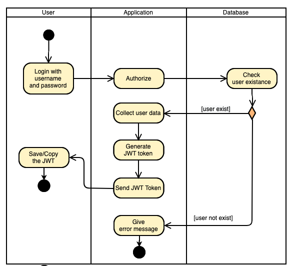
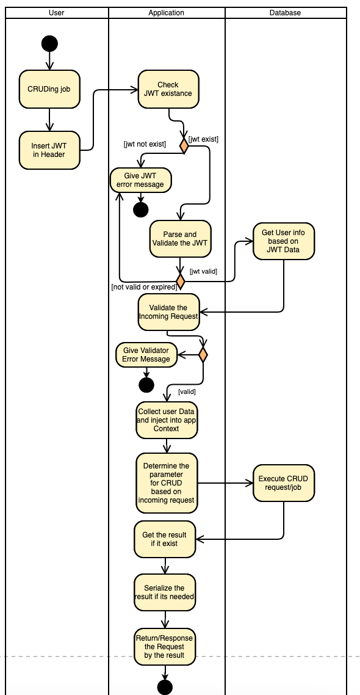
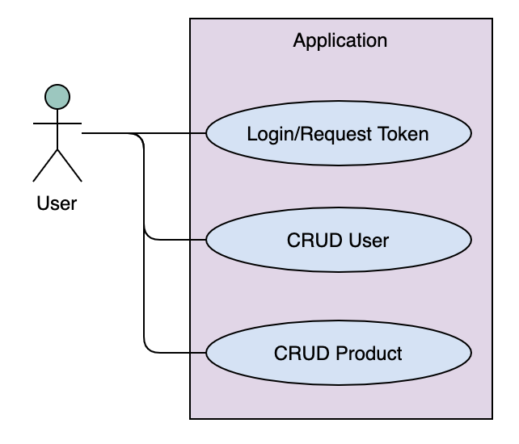

# go-pos-mini

## api documentation 📖
Postman: https://documenter.getpostman.com/view/6786432/UV5f9EWr

## stacks 🥞
- MySQL
- Golang
- Echo Framework
- GORM

## setup up ☕️

### clone 💾
Clone this repo using `Download` button or bash 👨‍💻

```bash
$ git clone https://github.com/hrz8/go-pos-mini.git
```

### environtment setup 🛠

Required to create `config.yml` file for the development purpose, can refer the `config.sample.yml` file.

`config.yml` file should be look like this:

```yml
SERVICE:
  RESTPORT: 3000
  JWTSECRET: yoursecret
  ADMINPASSWORD: password123
DATABASE: 
  HOST: localhost
  PORT: 3306
  USER: root
  PASSWORD: toor
  NAME: pos_mini
```

Details:
| Config                | Details                                                                                   |
|-----------------------|-------------------------------------------------------------------------------------------|
| SERVICE.RESTPORT      | This will be a rest server port                                                           |
| SERVICE.JWTSECRET     | A secret for JWT token that apps will generate from                                       |
| SERVICE.ADMINPASSWORD | This will be default password for dummy user (will be use to do a login to request token) |
| DATABASE.HOST         | The used database host/address                                                            |
| DATABASE.PORT         | Port of database                                                                          |
| DATABASE.USER         | Username for database access credentials                                                  |
| DATABASE.PASSWORD     | Password for database access credentials                                                  |
| DATABASE.NAME         | Database name that will be use to store the data                                          |

### database schema (erd) 📊


### activity diagram ⛳️

Login:



CRUD:



### usecase diagram 🔶



### data manipulation language used 🧮

| Command | Details                                                                   |
|---------|---------------------------------------------------------------------------|
| UPDATE  | To update the record based on user or product id                          |
| INSERT  | To add new record                                                         |
| WHERE   | Especially in UPDATE, it used to determine which record need to be update |

## run 🏃‍♂️

### cli 💻

```bash
$ go run main.go
```

Once this command executed, the migration will run automatically.

### vscode debug 🕵️‍♂️

Debug app using VsCode Debugger Tool

- Select your debugger to be set as `Launch to The Moon 🚀🌕`
- Press `F5` to run the debugging
- Done!

Once this executed, the migration will run automatically.

## author ℹ️

Hirzi Nurfakhrian